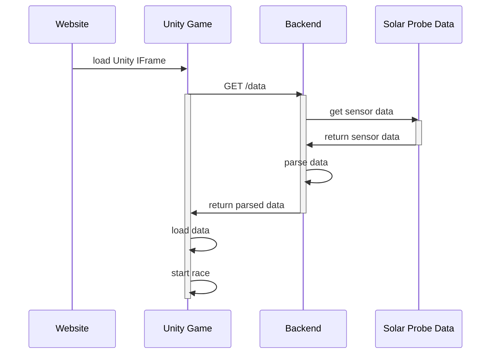

# Solar Wind Cars

Project made in [NASA Space Apps Challenge Prague 2022](https://2022.spaceappschallenge.org/) hackathon. The challenge was to display creatively  data form Parker Solar Probe.

Our team was called Singularity.

## Description

Welcome to Solar Wind Cars! Wanna settle a bet? Play by picking two dates and watch the race unfold.
If you want to know more about the Parker Solar Probe and our Sun and it’s corona, take a look at our learning section!

## Demo
[Click here](https://solarwindcars.eu/)

## What we created

* [Racing car game](https://github.com/team-singularity/solar-wind-cars-unity)
* [Website with education content](https://github.com/team-singularity/solar-wind-cars-FE)
* [Backend that parses data from Parker Solar Probe](https://github.com/team-singularity/solar-wind-cars-be)

## Technology
 * Unity
 * HTML/CSS/JS
 * Java BE with Spring Boot

## Repositories
* [solar-wind-cars-unity](https://github.com/team-singularity/solar-wind-cars-unity)
* [solar-wind-cars-fe](https://github.com/team-singularity/solar-wind-cars-fe)
* [solar-wind-cars-be](https://github.com/team-singularity/solar-wind-cars-be)

## Team
👨[karmik66](https://github.com/karmik66)

👩[gabriela-l](https://github.com/gabriela-l)

👨[martinbacon](https://github.com/martinbacon)

## Thanks to
* Car - https://sketchfab.com/3d-models/concept-car-038-public-domain-0b4ca2a15ba7478db2a42ac9f0e687bf (Unity Fan youtube channel)
* Satelite - https://sketchfab.com/3d-models/simple-satellite-low-poly-free-f23b484cda664f1cb91b4f62ea5ef8bf (DjalalxJay)
* SpaceSkies - https://assetstore.unity.com/packages/2d/textures-materials/sky/spaceskies-free-80503 (PULSAR BYTES)
* Space Background - https://codepen.io/ksenia-k/pen/gOPboQg (Ksenia Kondrashova)

## Architecture

<!--

**Here are some ideas to get you started:**

🙋‍♀️ A short introduction - what is your organization all about?
🌈 Contribution guidelines - how can the community get involved?
👩‍💻 Useful resources - where can the community find your docs? Is there anything else the community should know?
🍿 Fun facts - what does your team eat for breakfast?
🧙 Remember, you can do mighty things with the power of [Markdown](https://docs.github.com/github/writing-on-github/getting-started-with-writing-and-formatting-on-github/basic-writing-and-formatting-syntax)
-->
